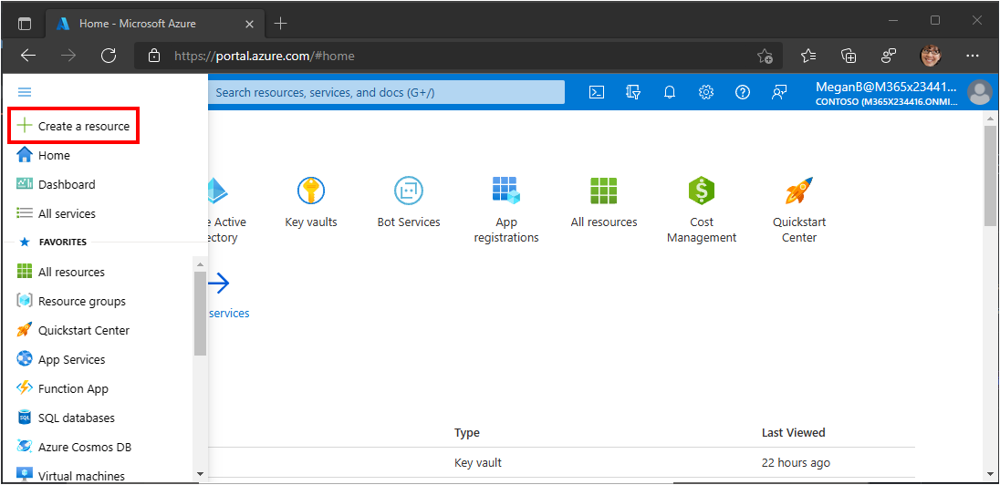
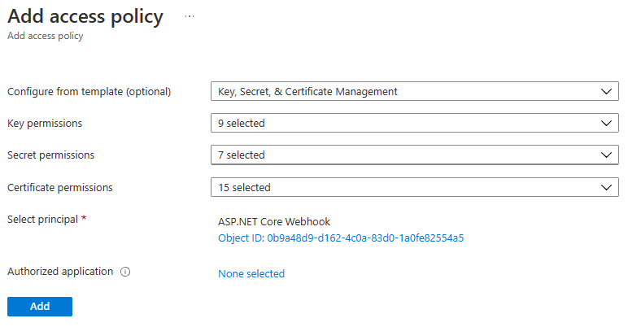

# Setting up Azure Key Vault

## Setting up a new Azure Key Vault

For official documentation on creating an Azure Key Vault, see [Quickstart: Create a key vault using the Azure portal](https://docs.microsoft.com/azure/key-vault/general/quick-create-portal).

> **Note:** you only need to go through the following steps if you **do not** have an existing Azure Key Vault, or if you want to use a separate Azure Key Vault for this sample.

1. Go to [Azure Portal](https://portal.azure.com/).

1. In the portal menu, select **Create a resource**.

    

1. Search for `Key Vault`. Select **Key Vault**, then select **Create**.

1. Fill in the required fields as appropriate for your Azure subscription, and select **Next: Access policy**.

1. Select **Add Access Policy**.

1. Change the **Configure from template** dropdown to **Key, Secret, & Certificate Management**.

1. For **Select principal**, select the **None selected**. Enter your application ID from your app registration in the search box, then select your app registration. Select **Select**.

    

1. Select **Add**, then select **Review + create**. Finally, select **Create**.

1. Wait for the Azure Key Vault to finish deploying, then follow the steps in [Adding a self-signed certificate](#adding-a-self-signed-certificate).

## Add your application to an existing Azure Key Vault

> **Note:** you only need to go through the following steps if you have an existing Azure Key Vault you want to reuse for the current sample.

1. Go to your existing Azure Key Vault in the Azure portal.

1. Select **Access policies** under **Settings**. Select **Add Access Policy**.

1. Change the **Configure from template** dropdown to **Key, Secret, & Certificate Management**.

1. For **Select principal**, select the **None selected**. Enter your application ID from your app registration in the search box, then select your app registration. Select **Select**.

1. Select **Add** to add the new access policy. Wait for your access policy to deploy.

## Adding a self-signed certificate

1. Go to the Key Vault in the Azure Portal.

1. Select **Certificates** under **Settings**, then select **Generate/Import**.

1. Provide values for **Certificate Name** and **Subject**. Leave all other fields at their defaults, then select **Create**.
