# Setting up Azure Key Vault

## Setting up a new Azure Key Vault

> Note: you only need to go through the following steps if you **do not** have an existing Azure KeyVault.

- **Step 1**: Go to [Azure Portal](https://portal.azure.com/).

- **Step 2**: Create a Resource Group
  - Click on the navigation icon in the Azure Portal, click on "Resource groups"; on the next screen click "+ Add"

    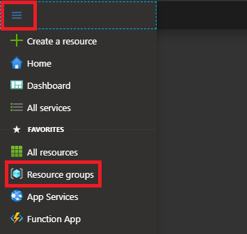

    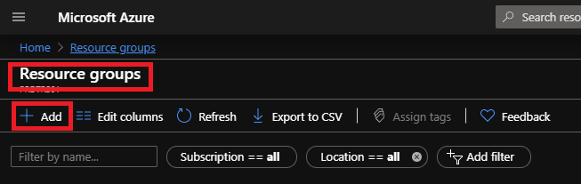

- Fill in the details as shown below and click "Review + create"; on the next screen click "Create"

    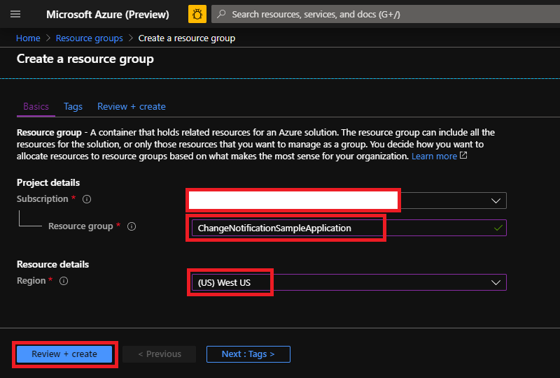

    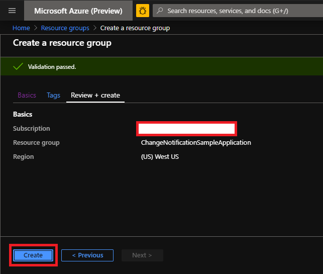

- **Step 3**: Create Azure Key Vault
  - Go to the resource group created in the step above, and click "+ Add", on the next screen search for "Key Vault" and hit the return key and then click "Create"

    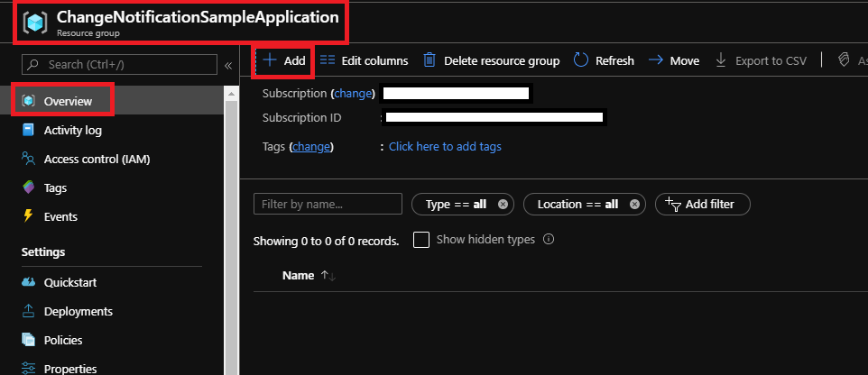

    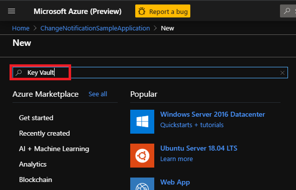

    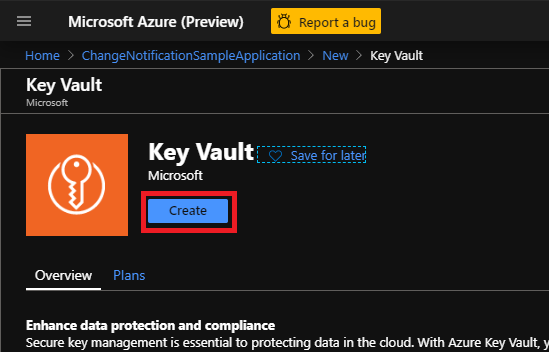

  - Fill in the required details as shown below and click "Access policy", then click "+ Add Access Policy"
    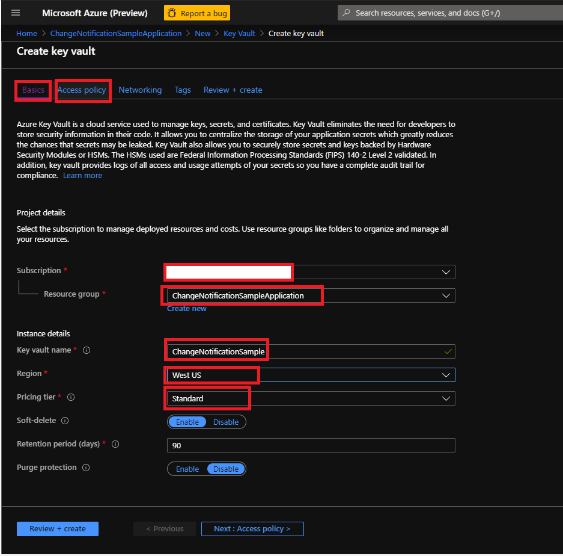

    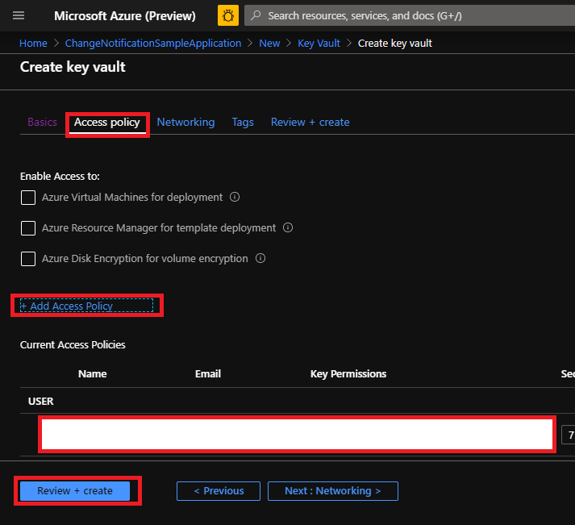

  - Fill in the required details and click "Select", then click "Add" and then click "Create"

    

    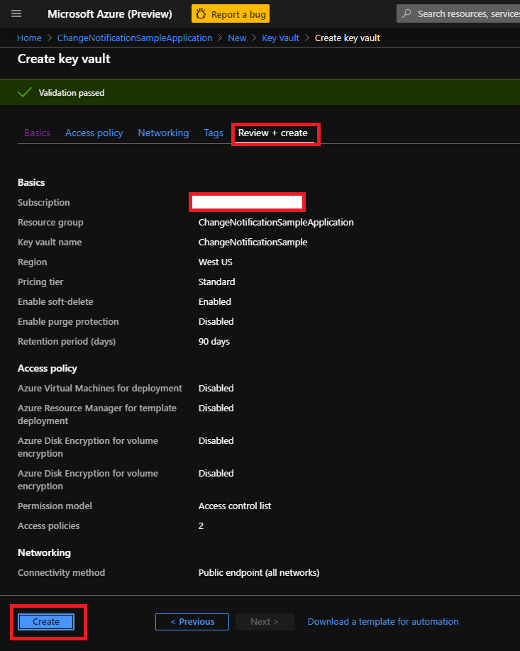

## Connect an existing Key Vault to your Azure AD appid

> Note: you only need to go through the following steps if you have an existing Azure KeyVault you want to reuse for the current sample.

1. Go to Access policies under Settings. Click Add Access Policy.
1. Under Secret Permissions, select Get and List.
1. Under Certificate Permissions, select Get and List.
1. Under Select principal, select your appid.
1. Click Add to finish your access policy. Wait for your access policy to deploy.

## Adding a self-signed certificate

Go to the Key Vault and click "Certificates", then click "+ Generate/Import"; Fill in the details as shown below and click "Create".

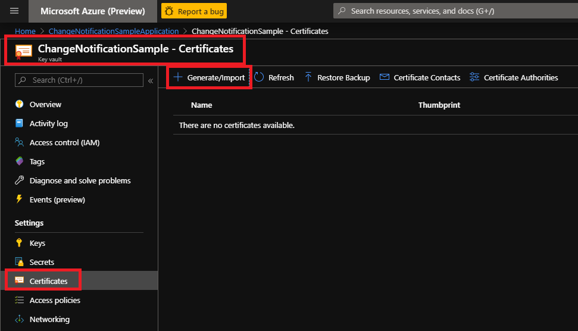

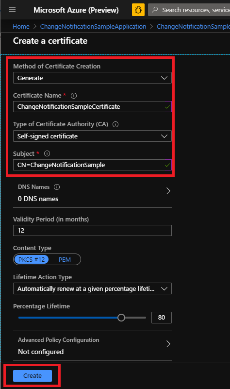
