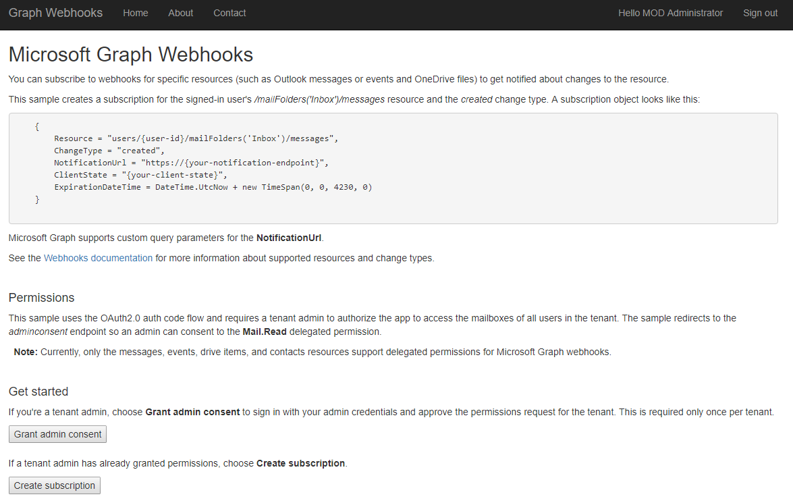
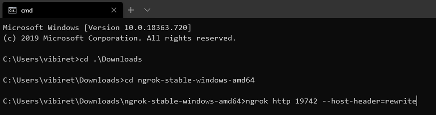
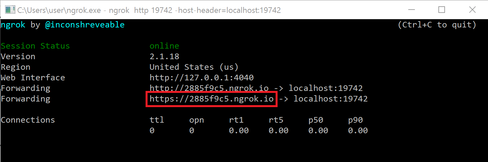

# Microsoft Graph Change Notifications Sample for ASP.NET Core


Subscribe for [Microsoft Graph webhooks](https://docs.microsoft.com/graph/api/resources/webhooks) to be notified when your user's data changes, so you don't have to poll for changes.

This sample ASP.NET Core web application shows how to subscribe for change notifications as well as how to validate and decrypt change notifications with resource data (preview) when supported by the resource.

This sample uses:

- [Microsoft Authentication Library for .NET](https://github.com/AzureAD/microsoft-authentication-library-for-dotnet) (MSAL.NET) to obtain an access token
- The [Microsoft Graph Client Library for .NET](https://github.com/microsoftgraph/msgraph-sdk-dotnet) (SDK) to call Microsoft Graph.
- The [Microsoft.Identity.Web](https://github.com/AzureAD/microsoft-identity-web) library to abstract some of the complexities.

This sample supports user-delegated authentication and uses:

- OpenID Connect for sign in / sign out using the Microsoft identity platform for developers
- The [auth code flow](https://docs.microsoft.com/azure/active-directory/develop/v2-oauth2-auth-code-flow)

This sample supports app-only authentication and uses:

- The [client grant flow](https://docs.microsoft.com/en-us/azure/active-directory/develop/v2-oauth2-client-creds-grant-flow) to obtain an access token.

>See the list of [permissions](https://docs.microsoft.com/graph/api/subscription-post-subscriptions?view=graph-rest-1.0) permitted for each supported resource in Microsoft Graph.

The sample app redirects to the Azure AD *adminconsent* endpoint so a tenant administrator can grant delegated permissions directly to the app. After the admin consents, users in the tenant can create a subscription and watch for notifications.

The following are common tasks that an application performs with webhooks subscriptions:

- Get consent to subscribe to users' resources and then get an access token.
- Use the access token to [create a subscription](https://docs.microsoft.com/graph/api/subscription-post-subscriptions) to a resource.
- Send back a validation token to confirm the notification URL.
- Listen for notifications from Microsoft Graph and respond with a 202 status code.
- Request more information about changed resources using data in the notification or decrypts the resource data provided with the notification if any has been provided.

## Using the Microsoft Graph Webhooks Sample

The screenshot below shows the app's start page.
  


After the app creates a subscription for the signed-in user, Microsoft Graph sends a notification to the registered endpoint when events happen in the user's subscribed resource. The app then reacts to the event.

This sample app subscribes to the `users/{user-id}/mailFolders('Inbox')/messages` resource for `created` changes. When notified that subscribed users receive a mail message, the app then updates a page with information about the message. The page displays only messages belonging to the signed-in user.

This project uses git submodules. After cloning the repository, make sure you execute the following commands:

```shell
git submodule init
git submodule update
```

### Prerequisites

To use the Microsoft Graph Webhook Sample for ASP.NET Core, you need the following:

- Visual Studio 2017 installed on your development computer.
- .NET Core 3.1 or later (for example for Windows) installed. You can follow the instructions at [.NET and C# - Get Started in 10 Minutes](https://www.microsoft.com/net/core). In addition to developing on Windows, you can develop on [Linux](https://www.microsoft.com/net/core#linuxredhat), [Mac](https://www.microsoft.com/net/core#macos), or [Docker](https://www.microsoft.com/net/core#dockercmd).
- A [work, school or personal account](https://dev.office.com/devprogram). A tenant administrator account is required to grant application permissions.
- The application ID and key from the application that you [register on the Azure Portal](#register-the-app).
- A public HTTPS endpoint to receive and send HTTP requests. You can host this on Microsoft Azure or another service, or you can [use ngrok](#ngrok) or a similar tool while testing.

### Create your app

#### Choose the tenant where you want to create your app

1. Sign in to the [Azure portal](https://portal.azure.com) using either a work or school account.
1. If your account is present in more than one Azure AD tenant:
   1. Select your profile from the menu on the top right corner of the page, and then **Switch directory**.
   1. Change your session to the Azure AD tenant where you want to create your application.

#### Register the app

1. Navigate to the [Azure portal > App registrations](https://go.microsoft.com/fwlink/?linkid=2083908) to register your app.
1. Select **New registration**.
1. When the **Register an application page** appears, enter your app's registration information:
   1. In the **Name** section, enter a meaningful name that will be displayed to users of the app. For example: `MyWebApp`
   1. In the **Supported account types** section, select **Accounts in any organizational directory and personal Microsoft accounts (e.g. Skype, Xbox, Outlook.com)**.
      > If there are more than one redirect URIs, you'll need to add these from the **Authentication** tab later after the app has been successfully created.
1. Select **Register** to create the app.
1. On the app's **Overview** page, find the **Application (client) ID** value and record it for later. You'll need this value to configure the Visual Studio configuration file for this project.
1. In the list of pages for the app, select **Authentication**.
   1. In the **Redirect URIs** section, select **Web** in the combo-box and enter the following redirect URIs:
       - `https://localhost:44334/signin-oidc`
       - `https://localhost:44334/Account/GrantPermissions`
1. Select **Save**.
1. From the **Certificates & secrets** page, in the **Client secrets** section, choose **New client secret**.
   1. Enter a key description (of instance `app secret`).
   1. Select a key duration of either **In 1 year**, **In 2 years**, or **Never Expires**.
   1. When you click the **Add** button, the key value will be displayed. Copy the key value and save it in a safe location.

      You'll need this key later to configure the project in Visual Studio. This key value will not be displayed again, nor retrievable by any other means, so record it as soon as it is visible from the Azure portal.

1. In the list of pages for the app, select **API permissions**.
   1. Click the **Add a permission** button and then make sure that the **Microsoft APIs** tab is selected.
   1. In the **Commonly used Microsoft APIs** section, select **Microsoft Graph**.
   1. In the **Application permissions** section, make sure that the **Mail.Read.** permission is checked. Use the search box if necessary.
    > Also, in the **Delegated permissions** section, check the User.Read delegated permission for Azure Active Directory, so users can sign into the app to initiate the subscription process.
   1. Select the **Add permissions** button.

### Set up the ngrok proxy (optional)

You must expose a public HTTPS endpoint to create a subscription and receive notifications from Microsoft Graph. While testing, you can use ngrok to temporarily allow messages from Microsoft Graph to tunnel to a *localhost* port on your computer.

You can use the ngrok web interface (http://127.0.0.1:4040) to inspect the HTTP traffic that passes through the tunnel. To learn more about using ngrok, see the [ngrok website](https://ngrok.com/).  

1. In Solution Explorer, right-click the **GraphWebhooks-Core** project and choose **Properties**.

1. On the **Debug** tab, copy the port number of the **App URL**.

   

1. [Download ngrok](https://ngrok.com/download) for Windows.  

1. Unzip the package and run ngrok.exe.

1. Replace the two *{port-number}* placeholder values in the following command with the port number you copied, and then run the command in the ngrok console.

   `ngrok http {port-number} -host-header=localhost:{port-number}`

   

1. Copy the HTTPS URL that's shown in the console. You'll use this to configure your notification URL in the sample.

   

Keep the console open while testing. If you close it, the tunnel also closes and you'll need to generate a new URL and update the sample.

>See [Hosting without a tunnel](https://github.com/microsoftgraph/nodejs-webhooks-rest-sample/wiki/Hosting-the-sample-without-a-tunnel) and [Why do I have to use a tunnel?](https://github.com/microsoftgraph/nodejs-webhooks-rest-sample/wiki/Why-do-I-have-to-use-a-tunnel) for more information about using tunnels.

## Configure and run the sample

1. Follow these [instructions](https://docs.microsoft.com/aspnet/core/signalr/javascript-client?view=aspnetcore-2.2) to install the ASP.NET Core SignalR Javascript client package into the app.
1. Expose a public HTTPS notification endpoint. It can run on a service such as Microsoft Azure, or you can create a proxy web server by [using ngrok](#ngrok) or a similar tool.

1. Open the **GraphWebhooks-Core.sln** sample file in Visual Studio 2017.

1. In Solution Explorer, open the **appsettings.json** file in the root directory of the project.  

   - For the **NotificationUrl** key, replace *ENTER_YOUR_URL* with the HTTPS URL. Keep the */notification/listen* portion.

   If you're using ngrok, use the HTTPS URL that you copied. The value will look something like this:

   `"NotificationUrl": "https://2885f9c5.ngrok.io/notification/listen",`

   This is the url endpoint that will receive subscription validation callbacks and notification events from Graph, through the proxy server set up above (ngrok, for this sample).

1. Still within Solution Explorer, right-click on the project name and select **Manage User Secrets**. This app uses [Secret Manager](https://docs.microsoft.com/aspnet/core/fundamentals/configuration/?view=aspnetcore-2.2) configuration in storing sensitive app data - ClientId and ClientSecret.

    - In the **secret.json** window that opens, paste the below code.

        `"AzureAd": {
        "ClientId": "ENTER_YOUR_APP_ID",
        "ClientSecret": "ENTER_YOUR_SECRET"
  }`

    - For the **ClientId** key, replace *ENTER_YOUR_APP_ID* with the application ID of your registered Azure application.  
    - For the **ClientSecret** key, replace *ENTER_YOUR_SECRET* with the key of your registered Azure application. Note that in production apps you should always use certificates as your application secrets, but for this sample we will use a simple shared secret password.

1. Make sure that the ngrok console is still running, then press F5 to build and run the solution in debug mode.

   >If you get errors while installing packages, make sure the local path where you placed the solution is not too long/deep. Moving the solution closer to the root drive resolves this issue.

### Use the app to create a subscription

1. Choose **Sign in** in the upper-right corner and sign in with a work or school account.

1. Consent to the **View your basic profile** and **Sign in as you** permissions.

1. On the sample home page, choose **Grant admin consent**. You'll be redirected to the *adminconsent* page.

1. Sign in as a tenant admin and consent to the **Read mail in all mailboxes** and **Sign in and read user profile** permissions. You'll be redirected back to the sample's home page.

   At this point, any user in your tenant can sign in and create a subscription. If you don't grant admin permissions first, you'll receive an *Unauthorized* error. You'll need to open the sample in a new browser session because this sample caches the initial token.

1. Choose **Create subscription**. The **Subscription** page loads with information about the subscription.

   >This sample sets the subscription expiration to 15 minutes for testing purposes.

   

1. Choose the **Watch for notifications** button.

1. Send an email to your user account. The **Notification** page displays message properties. It may take several seconds for the page to update.

1. Optionally choose the **Delete subscription** button.

## Key components of the sample

The following files contain code that's related to connecting to Microsoft Graph, creating subscriptions, and handling notifications.

- [`appsettings.json`](https://github.com/microsoftgraph/aspnetcore-apponlytoken-webhooks-sample/blob/master/src/GraphWebhooks-Core/appsettings.json) Contains values used for authentication, authorization and endpoint URLs.
- secrets.json Contains the ClientId and ClientSecret used for authentication and authorization. To check whether these have been configured for the project run the following command from the directory in which the .csproj file exists:
`dotnet user-secrets list`
- [`Startup.cs`](https://github.com/microsoftgraph/aspnetcore-apponlytoken-webhooks-sample/blob/master/src/GraphWebhooks-Core/Startup.cs) Configures the app and the services it uses, including authentication.

### Controllers  

- [`AccountController.cs`](https://github.com/microsoftgraph/aspnetcore-apponlytoken-webhooks-sample/blob/master/src/GraphWebhooks-Core/Controllers/AccountController.cs) Handles admin consent.  
- [`NotificationController.cs`](https://github.com/microsoftgraph/aspnetcore-apponlytoken-webhooks-sample/blob/master/src/GraphWebhooks-Core/Controllers/NotificationController.cs) Receives notifications.  
- [`SubscriptionContoller.cs`](https://github.com/microsoftgraph/aspnetcore-apponlytoken-webhooks-sample/blob/master/src/GraphWebhooks-Core/Controllers/SubscriptionController.cs) Creates and deletes subscriptions.

### Models

- [`Notification.cs`](https://github.com/microsoftgraph/aspnetcore-apponlytoken-webhooks-sample/blob/master/src/GraphWebhooks-Core/Models/Notification.cs) Represents a change notification.
- [`MessageViewModel.cs`](https://github.com/microsoftgraph/aspnetcore-apponlytoken-webhooks-sample/blob/master/src/GraphWebhooks-Core/Models/MessageViewModel.cs) Defines the **MessageViewModel** that represents the data displayed in the Notification view.

### Helpers

- [`GraphServiceClientFactory.cs`](https://github.com/microsoftgraph/aspnetcore-apponlytoken-webhooks-sample/blob/master/src/GraphWebhooks-Core/Helpers/GraphServiceClientFactory.cs) Initiates the SDK client used to interact with Microsoft Graph.
- [`SubscriptionStore.cs`](https://github.com/microsoftgraph/aspnetcore-apponlytoken-webhooks-sample/blob/master/src/GraphWebhooks-Core/Helpers/SubscriptionStore.cs) Access layer for stored subscription information. The sample temporarily stores the info in HttpRuntime.Cache. Production apps will typically use some method of persistent storage.

### Microsoft.Identity.Web

- Helper library containing a set of reusable classes that are useful in helping with the below:
  - Authenticating and signing-in users with any Work, School
   or Microsoft Personal Accounts on the Microsoft identity platform v2.0 (AAD v2.0) using OpenId connect middleware and MSAL.NET.
  - Handling sign-out and removing the account from MSAL.NET cache.
  - Token acquisition on behalf of the signed in user.
  - Bootstrapping the web resource from the `Startup.cs` file in the application by just calling a few methods.

## Troubleshooting

See the dedicated [troubleshooting page](./TROUBLESHOOTING.md).

## Contributing

If you'd like to contribute to this sample, see [CONTRIBUTING.MD](./CONTRIBUTING.md).

This project has adopted the [Microsoft Open Source Code of Conduct](https://opensource.microsoft.com/codeofconduct/). For more information see the [Code of Conduct FAQ](https://opensource.microsoft.com/codeofconduct/faq/) or contact [opencode@microsoft.com](mailto:opencode@microsoft.com) with any additional questions or comments.

## Questions and comments

We'd love to get your feedback about the Microsoft Graph Webhooks sample for ASP.NET Core. You can send your questions and suggestions to us in the [Issues](https://github.com/microsoftgraph/aspnetcore-webhooks-sample/issues) section of this repository.

Questions about Microsoft Graph in general should be posted to [Stack Overflow](https://stackoverflow.com/questions/tagged/MicrosoftGraph). Make sure that your questions or comments are tagged with *[MicrosoftGraph]*.

You can suggest changes for Microsoft Graph on [UserVoice](https://microsoftgraph.uservoice.com/).

## Additional resources

- [Microsoft Graph Webhooks sample for ASP.NET 4.6](https://github.com/microsoftgraph/aspnet-webhooks-rest-sample) (Delegated permissions)
- [Microsoft Graph Webhooks sample for Node.js](https://github.com/microsoftgraph/nodejs-webhooks-rest-sample) (Delegated permissions)
- [Working with Webhooks in Microsoft Graph](https://docs.microsoft.com/graph/api/resources/webhooks)
- [Subscription resource](https://docs.microsoft.com/graph/api/resources/subscription)
- [Microsoft Graph documentation](https://docs.microsoft.com/graph)

## Copyright

Copyright (c) 2019 Microsoft. All rights reserved.
