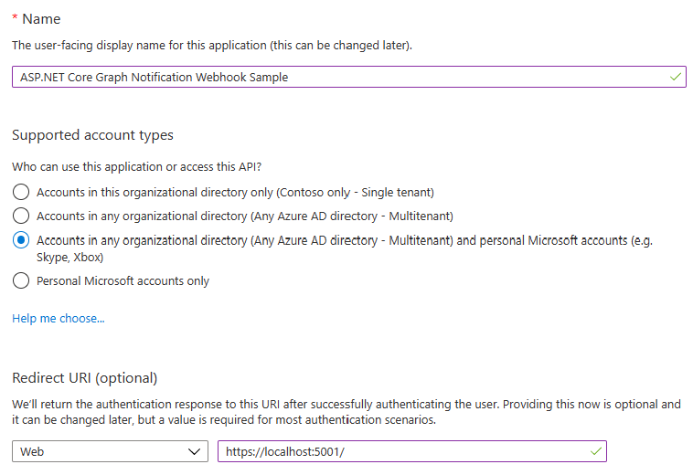
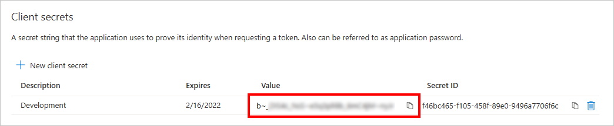
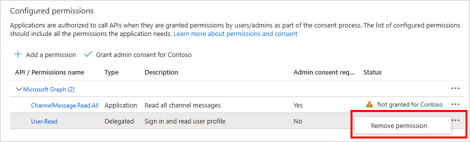
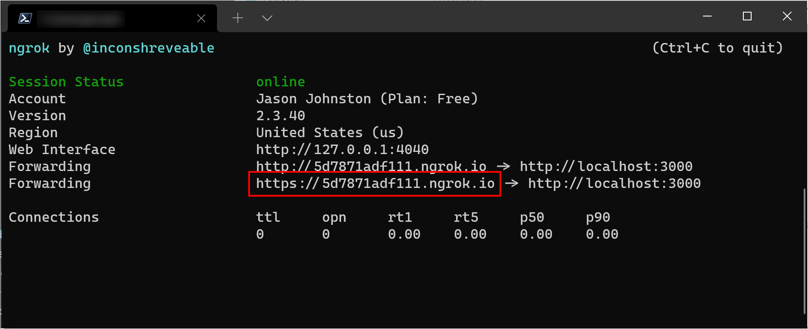
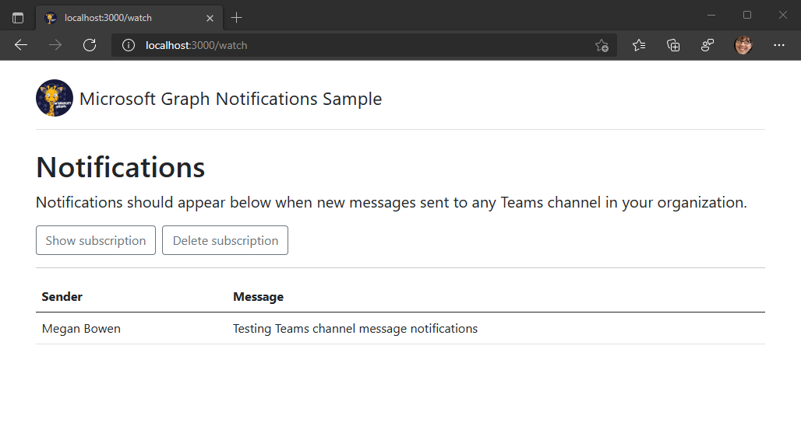

# Microsoft Graph Change Notifications Sample for ASP.NET Core


Subscribe for [Microsoft Graph change notifications](https://docs.microsoft.com/graph/api/resources/webhooks) to be notified when your user's data changes, so you don't have to poll for changes.

This sample ASP.NET Core web application shows how to subscribe for change notifications as well as how to validate and decrypt change notifications with resource data when supported by the resource.

This sample uses:

- The [Microsoft Graph Client Library for .NET](https://github.com/microsoftgraph/msgraph-sdk-dotnet) (SDK) to call Microsoft Graph.
- The [Microsoft.Identity.Web](https://github.com/AzureAD/microsoft-identity-web) library to abstract token acquisition.

## Using the Microsoft Graph Webhooks Sample

This sample implements the following scenarios.

- Uses user-delegated authentication to subscribe to notifications in a user's Exchange Online inbox.
- Uses app-only authentication to subscribe to notifications for all new Teams channel messages. These notifications include encrypted resource data.

[User-delegated authentication](https://docs.microsoft.com/graph/auth-v2-user) represents a user and the application being used when calling the Microsoft Graph. This type of authentication is best suited for scenarios when the user interacts with the application. [Application only authentication](https://docs.microsoft.com/graph/auth-v2-service) represents only the application itself when calling the Microsoft Graph, without any notion of user. This type of authentication is best suited for background services, daemons or other kind of applications users are not directly interacting with.

> See the list of [permissions and authentication types](https://docs.microsoft.com/graph/api/subscription-post-subscriptions?view=graph-rest-1.0) permitted for each supported resource in Microsoft Graph.

### Prerequisites

To use the Microsoft Graph Webhook Sample for ASP.NET Core, you need the following:

- [.NET 8.0](https://dotnet.microsoft.com/download) or later.
- A [work, or school account](https://dev.office.com/devprogram). **Note:** The app-only Teams channel scenario in the sample requires a tenant administrator account to grant application permissions for the app-only portion.
- The application ID and secret from the application that you [register on the Azure Portal](#create-the-app-registration).
- A public HTTPS endpoint to receive and send HTTP requests. You can host this on Microsoft Azure or another service, or you can [use ngrok](#set-up-the-ngrok-proxy-optional) or a similar tool while testing.
- If you are also testing change notifications with resource data, you also need a Microsoft Azure subscription to create an Azure Key Vault. If you do not have a Microsoft Azure subscription, you can [start a free trial](https://azure.microsoft.com/free/).

### Create the app registration

#### Choose the tenant where you want to create your app

1. Sign in to the [Azure portal](https://portal.azure.com) using either a work or school account.
1. If your account is present in more than one Azure AD tenant:
    1. Select your profile from the menu on the top right corner of the page, and then **Switch directory**.
    1. Change your session to the Azure AD tenant where you want to create your application.

#### Register the app

1. Select **Azure Active Directory** in the left-hand navigation, then select [App registrations](https://go.microsoft.com/fwlink/?linkid=2083908) under **Manage**.

    

1. Select **New registration**. On the **Register an application** page, set the values as follows.

    - Set **Name** to `ASP.NET Graph Notification Webhook Sample`.
    - Set **Supported account types** to **Accounts in any organizational directory (Any Azure AD directory - Multitenant) and personal Microsoft accounts**.
    - Under **Redirect URI**, set the first drop-down to `Web` and set the value to `https://localhost:5001/`.

    

1. Select **Register** to create the app. On the app's **Overview** page, copy the value of the **Application (client) ID** and **Directory (tenant) ID** and save them for later.

1. Select **Authentication** under **Manage**. Add an additional **Redirect URI** with the value `https://localhost:5001/signin-oidc`.

1. Set the **Front-channel logout URL** to `https://localhost:5001/signout-oidc`. Select **Save**.

1. Select **Certificates & secrets** under **Manage**. Select the **New client secret** button. Enter a value in **Description** and select one of the options for **Expires** and select **Add**.

1. Copy the **Value** of the new secret **before** you leave this page. It will never be displayed again. Save the value for later.

    

1. Select **API permissions** under **Manage**.

1. In the list of pages for the app, select **API permissions**, then select **Add a permission**.

1. Make sure that the **Microsoft APIs** tab is selected, then select **Microsoft Graph**.

1. Select **Application permissions**, then find and enable the **ChannelMessage.Read.All** permission. Select **Add permissions** to add the enabled permission.

    > **Note:** To create subscriptions for other resources you need to select different permissions as documented [here](https://docs.microsoft.com/graph/api/subscription-post-subscriptions#permissions)

1. In the **Configured permissions** list, select the ellipses (`...`) in the **User.Read** row, and select **Remove permission**. The **User.Read** permission will be requested dynamically as part of the user sign-in process.

    

1. Select **Grant admin consent for `name of your organization`** and **Yes**. This grants consent to the permissions of the application registration you just created to the current organization.

### Setting up Azure Key Vault

*Note: The app-only scenario in this sample requires this step. It assumes that the public/private key pair for encrypting and decrypting resource data in the notification payloads are stored in Azure Key Vault. Refer to [the documentation](https://docs.microsoft.com/graph/api/resources/webhooks?view=graph-rest-beta) for a complete list of resources that support including resources data.*

Follow the [documented steps](./KEYVAULT.md) to configure your Azure KeyVault in order to add support for change notifications with resource data.

### Set up the ngrok proxy (optional)

You must expose a public HTTPS endpoint to create a subscription and receive notifications from Microsoft Graph. While testing, you can use ngrok to temporarily allow messages from Microsoft Graph to tunnel to a *localhost* port on your computer.

You can use the ngrok web interface (`http://127.0.0.1:4040`) to inspect the HTTP traffic that passes through the tunnel. To learn more about using ngrok, see the [ngrok website](https://ngrok.com/).

1. [Download ngrok](https://ngrok.com/download).

1. Run the following command in your command-line interface.

    ```Shell
    ngrok http https://localhost:5001
    ```

1. Copy the HTTPS URL that's shown in the console. You'll use this to configure your notification URL in the sample.

    

Keep the console open while testing. If you close it, the tunnel also closes and you'll need to generate a new URL and update the sample.

> See [troubleshooting](./TROUBLESHOOTING.md) for more information about using tunnels.

## Configure and run the sample

1. Expose a public HTTPS notification endpoint. It can run on a service such as Microsoft Azure, or you can create a proxy web server by [using ngrok](#set-up-the-ngrok-proxy-optional) or a similar tool.

1. Open **appsettings.json** in the root directory of the project.

    > **Note:** During development, it's recommended that you use the [.NET Secret Manager](https://docs.microsoft.com/aspnet/core/security/app-secrets?view=aspnetcore-5.0&tabs=windows#secret-manager) to store secrets instead of putting them in appsettings.json.

    - Settings under **AzureAd**:
        - **TenantId**: Your tenant ID (obtained when registering the application)
        - **ClientId**: Your application ID (obtained when registering the application)
        - **ClientSecret**: Your client secret (obtained when registering the application) **RECOMMENDED: set this in Secret Manager instead:** `dotnet user-secrets set AzureAd:ClientSecret "YOUR_CLIENT_SECRET"`.
    - **GraphScopes**: The Graph permission scopes used in the user-delegated scenario. These are already set for the user's inbox scenario. You'll need to change these if you subscribe to a different resource.
    - **NotificationHost**: Set to the host name of the server that hosts your application. During local development, set this to your ngrok URL.
    - Settings under **KeyVault**:
        - **Url**: The URL to your Azure Key Vault
        - **CertificateName** The name of the certificate in your Azure Key Vault

1. Make sure that the ngrok console is still running, then run the app with the following command.

    ```Shell
    dotnet run
    ```

    > **Note:** You can use [Visual Studio Code](https://code.visualstudio.com/) to set breakpoints and run the sample in debug mode.

### Use the app to create a subscription

#### Use delegated authentication to subscribe to a user's inbox

1. Choose the **Sign in and subscribe** button and sign in with a work or school account.

1. Review and consent to the requested permissions. The subscription is created and you are redirected to a page displaying any notification being received.

1. Send an email to yourself. A notification appears showing the subject and message ID.

    

#### Use app-only authentication to subscribe to Teams channel messages

1. If you previously subscribed to a user's inbox, choose the **Delete subscription** button to return to the home page.

1. Choose the **Subscribe** button. The subscription is created and you are redirected to a page displaying any notification being received.

1. Post a message to a channel in any team in Microsoft Teams. A notification appears showing the sender's name and the message.

    

## Troubleshooting

See the dedicated [troubleshooting page](./TROUBLESHOOTING.md).

## Contributing

If you'd like to contribute to this sample, see [CONTRIBUTING.MD](./CONTRIBUTING.md).

This project has adopted the [Microsoft Open Source Code of Conduct](https://opensource.microsoft.com/codeofconduct/). For more information see the [Code of Conduct FAQ](https://opensource.microsoft.com/codeofconduct/faq/) or contact [opencode@microsoft.com](mailto:opencode@microsoft.com) with any additional questions or comments.

## Questions and comments

We'd love to get your feedback about the Microsoft Graph Webhooks sample for ASP.NET Core. You can send your questions and suggestions to us in the [Issues](https://github.com/microsoftgraph/aspnetcore-webhooks-sample/issues) section of this repository.

Questions about Microsoft Graph in general should be posted to [Microsoft Q&A](https://docs.microsoft.com/answers/products/graph). Make sure that your questions or comments are tagged with the relevant Microsoft Graph tag.

## Additional resources

- [Microsoft Graph Webhooks sample for Node.js](https://github.com/microsoftgraph/nodejs-webhooks-sample)
- [Microsoft Graph Webhooks sample for Java Spring](https://github.com/microsoftgraph/java-spring-webhooks-sample)
- [Working with Webhooks in Microsoft Graph](https://docs.microsoft.com/graph/api/resources/webhooks)
- [Subscription resource](https://docs.microsoft.com/graph/api/resources/subscription)
- [Microsoft Graph documentation](https://docs.microsoft.com/graph)
