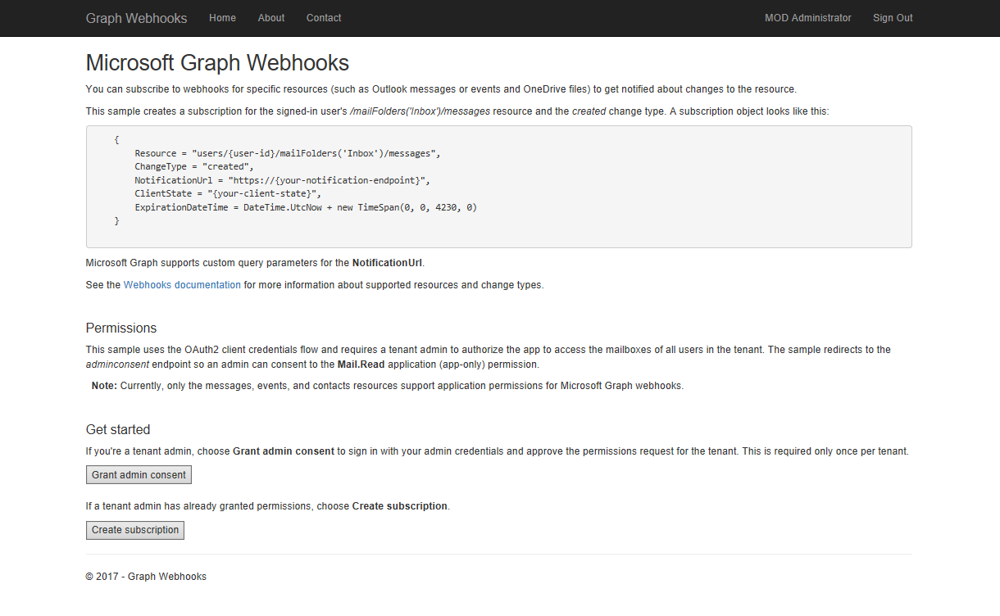
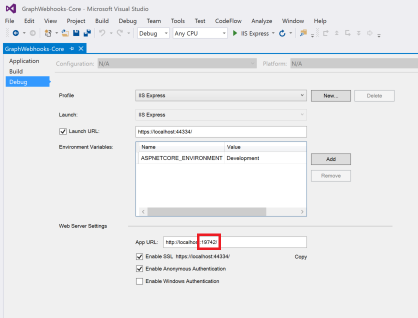
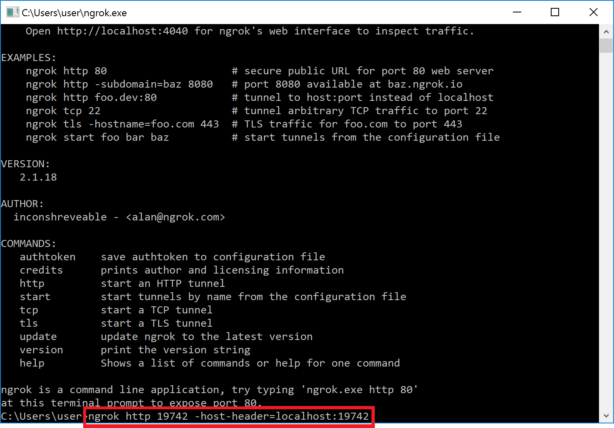
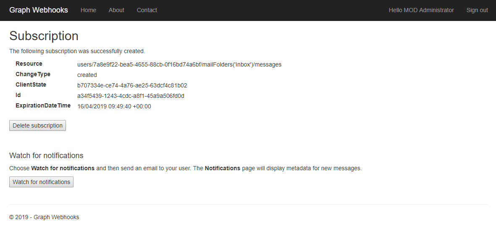

# Microsoft Graph Webhooks Sample for ASP.NET Core

Subscribe for [Microsoft Graph webhooks](https://developer.microsoft.com/en-us/graph/docs/api-reference/v1.0/resources/webhooks) to be notified when your user's data changes, so you don't have to poll for changes.

This sample ASP.NET Core web application shows how to subscribe for webhooks using application (app-only) permissions. It uses OpenID Connect for sign in, [Azure AD Authentication Library for .NET](https://github.com/AzureAD/azure-activedirectory-library-for-dotnet) (ADAL) to obtain an access token using the [client credentials grant](https://tools.ietf.org/html/rfc6749#section-4.4), and the [Microsoft Graph Client Library for .NET](https://github.com/microsoftgraph/msgraph-sdk-dotnet) (SDK) to interact with Microsoft Graph. 

>Currently, only Outlook messages, events, and contacts resources support application permissions. Application permissions are not yet supported for Group conversations or OneDrive drive root items.

The sample app redirects to the Azure AD *adminconsent* endpoint so a tenant administrator can grant application permissions directly to the app. After the admin consents, users in the tenant can create a subscription and watch for notifications. 

**Note:** Although individual users initiate the subscription process for their own user account, the access token that's used to create the subscription carries an application-level role, not a user-level scope.

The following are common tasks that an application performs with webhooks subscriptions:

- Get consent to subscribe to users' resources and then get an access token.
- Use the access token to [create a subscription](https://developer.microsoft.com/en-us/graph/docs/api-reference/v1.0/api/subscription_post_subscriptions) to a resource.
- Send back a validation token to confirm the notification URL.
- Listen for notifications from Microsoft Graph and respond with a 202 status code.
- Request more information about changed resources using data in the notification.

## Using the Microsoft Graph Webhooks Sample

The screenshot below shows the app's start page. 
  

After the app creates a subscription for the signed-in user (using an app-only token), Microsoft Graph sends a notification to the registered endpoint when events happen in the user's subscribed resource. The app then reacts to the event.

This sample app subscribes to the `users/{user-id}/mailFolders('Inbox')/messages` resource for `created` changes. When notified that subscribed users receive a mail message, the app then updates a page with information about the message. The page displays only messages belonging to the signed-in user.

### Prerequisites

To use the Microsoft Graph Webhook Sample for ASP.NET Core, you need the following:

- Visual Studio 2015 installed on your development computer. 
- A [work or school account](https://dev.office.com/devprogram). A tenant administrator account is required to grant application permissions. 
- The application ID and key from the application that you [register on the Azure Portal](#register-the-app). 
- A public HTTPS endpoint to receive and send HTTP requests. You can host this on Microsoft Azure or another service, or you can [use ngrok](#ngrok) or a similar tool while testing.

### Create your app

#### Choose the tenant where you want to create your app

1. Sign in to the [Azure portal](https://portal.azure.com) using either a work or school account.
1. If your account is present in more than one Azure AD tenant:
   1. Select your profile from the menu on the top right corner of the page, and then **Switch directory**.
   1. Change your session to the Azure AD tenant where you want to create your application.

#### Register the app

1. Navigate to the [Azure portal > App registrations](https://go.microsoft.com/fwlink/?linkid=2083908) to register your app.
1. Select **New registration**.
1. When the **Register an application page** appears, enter your app's registration information:
   1. In the **Name** section, enter a meaningful name that will be displayed to users of the app. For example: `MyWebApp`
   1. In the **Supported account types** section, select **Accounts in any organizational directory and personal Microsoft accounts (e.g. Skype, Xbox, Outlook.com)**.
      > If there are more than one redirect URIs, you'll need to add these from the **Authentication** tab later after the app has been successfully created.
1. Select **Register** to create the app.
1. On the app's **Overview** page, find the **Application (client) ID** value and record it for later. You'll need this value to configure the Visual Studio configuration file for this project.
1. In the list of pages for the app, select **Authentication**.
   1. In the **Redirect URIs** section, select **Web** in the combo-box and enter the following redirect URIs:
       - `https://localhost:44334/signin-oidc`
       - `https://localhost:44334/Account/GrantPermissions`
1. Select **Save**.
1. From the **Certificates & secrets** page, in the **Client secrets** section, choose **New client secret**.
   1. Enter a key description (of instance `app secret`).
   1. Select a key duration of either **In 1 year**, **In 2 years**, or **Never Expires**.
   1. When you click the **Add** button, the key value will be displayed. Copy the key value and save it in a safe location.

      You'll need this key later to configure the project in Visual Studio. This key value will not be displayed again, nor retrievable by any other means, so record it as soon as it is visible from the Azure portal.

1. In the list of pages for the app, select **API permissions**.
   1. Click the **Add a permission** button and then make sure that the **Microsoft APIs** tab is selected.
   1. In the **Commonly used Microsoft APIs** section, select **Microsoft Graph**.
   1. In the **Application permissions** section, make sure that the **Mail.Read.** permission is checked. Use the search box if necessary.
    > Also, in the **Delegated permissions** section, check the User.Read delegated permission for Azure Active Directory, so users can sign into the app to initiate the subscription process.
   1. Select the **Add permissions** button.
   

### Set up the ngrok proxy (optional) 
You must expose a public HTTPS endpoint to create a subscription and receive notifications from Microsoft Graph. While testing, you can use ngrok to temporarily allow messages from Microsoft Graph to tunnel to a *localhost* port on your computer. 

You can use the ngrok web interface (http://127.0.0.1:4040) to inspect the HTTP traffic that passes through the tunnel. To learn more about using ngrok, see the [ngrok website](https://ngrok.com/).  

1. In Solution Explorer, right-click the **GraphWebhooks-Core** project and choose **Properties**. 

1. On the **Debug** tab, copy the port number of the **App URL**. 

	

1. [Download ngrok](https://ngrok.com/download) for Windows.  

1. Unzip the package and run ngrok.exe.

1. Replace the two *{port-number}* placeholder values in the following command with the port number you copied, and then run the command in the ngrok console.

   `ngrok http {port-number} -host-header=localhost:{port-number}`

	

1. Copy the HTTPS URL that's shown in the console. You'll use this to configure your notification URL in the sample.

	

Keep the console open while testing. If you close it, the tunnel also closes and you'll need to generate a new URL and update the sample.

>See [Hosting without a tunnel](https://github.com/microsoftgraph/nodejs-webhooks-rest-sample/wiki/Hosting-the-sample-without-a-tunnel) and [Why do I have to use a tunnel?](https://github.com/microsoftgraph/nodejs-webhooks-rest-sample/wiki/Why-do-I-have-to-use-a-tunnel) for more information about using tunnels.

## Configure and run the sample

1. Expose a public HTTPS notification endpoint. It can run on a service such as Microsoft Azure, or you can create a proxy web server by [using ngrok](#ngrok) or a similar tool.

1. Open the **GraphWebhooks-Core.sln** sample file in Visual Studio 2015. 

1. In Solution Explorer, open the **appsettings.json** file in the root directory of the project.  
   a. For the **AppId** key, replace *ENTER_YOUR_APP_ID* with the application ID of your registered Azure application.  
   b. For the **AppSecret** key, replace *ENTER_YOUR_SECRET* with the key of your registered Azure application. Note that in production apps you should always use certificates as your application secrets, but for this sample we will use a simple shared secret password.  
   c. For the **NotificationUrl** key, replace *ENTER_YOUR_URL* with the HTTPS URL. Keep the */notification/listen* portion. 
   
   If you're using ngrok, use the HTTPS URL that you copied. The value will look something like this:

   `"NotificationUrl": "https://2885f9c5.ngrok.io/notification/listen",`

1. Make sure that the ngrok console is still running, then press F5 to build and run the solution in debug mode. 

   >If you get errors while installing packages, make sure the local path where you placed the solution is not too long/deep. Moving the solution closer to the root drive resolves this issue.

### Use the app to create a subscription
 

1. Choose **Sign in** in the upper-right corner and sign in with a work or school account. 

1. Consent to the **View your basic profile** and **Sign in as you** permissions. 

1. On the sample home page, choose **Grant admin consent**. You'll be redirected to the *adminconsent* page.

1. Sign in as a tenant admin and consent to the **Read mail in all mailboxes** and **Sign in and read user profile** permissions. You'll be redirected back to the sample's home page. 

   At this point, any user in your tenant can sign in and create a subscription. If you don't grant admin permissions first, you'll receive an *Unauthorized* error. You'll need to open the sample in a new browser session because this sample caches the initial token.
    
1. Choose **Create subscription**. The **Subscription** page loads with information about the subscription.

   >This sample sets the subscription expiration to 15 minutes for testing purposes.

	
	
1. Choose the **Watch for notifications** button. 

1. Send an email to your user account. The **Notification** page displays message properties. It may take several seconds for the page to update.

1. Optionally choose the **Delete subscription** button. 

## Key components of the sample 
The following files contain code that's related to connecting to Microsoft Graph, creating subscriptions, and handling notifications.

- [`appsettings.json`](https://github.com/microsoftgraph/aspnetcore-apponlytoken-webhooks-sample/blob/master/src/GraphWebhooks-Core/appsettings.json) Contains values used for authentication and authorization. 
- [`Startup.cs`](https://github.com/microsoftgraph/aspnetcore-apponlytoken-webhooks-sample/blob/master/src/GraphWebhooks-Core/Startup.cs) Configures the app and the services it uses, including authentication.

**Controllers**  
- [`AccountController.cs`](https://github.com/microsoftgraph/aspnetcore-apponlytoken-webhooks-sample/blob/master/src/GraphWebhooks-Core/Controllers/AccountController.cs) Handles sign in, sign out, and admin consent.  
- [`NotificationController.cs`](https://github.com/microsoftgraph/aspnetcore-apponlytoken-webhooks-sample/blob/master/src/GraphWebhooks-Core/Controllers/NotificationController.cs) Receives notifications.  
- [`SubscriptionContoller.cs`](https://github.com/microsoftgraph/aspnetcore-apponlytoken-webhooks-sample/blob/master/src/GraphWebhooks-Core/Controllers/SubscriptionController.cs) Creates and deletes subscriptions.

**Models**  
- [`Notification.cs`](https://github.com/microsoftgraph/aspnetcore-apponlytoken-webhooks-sample/blob/master/src/GraphWebhooks-Core/Models/Notification.cs) Represents a change notification. 

**Helpers**  
- [`SampleAuthProvider.cs`](https://github.com/microsoftgraph/aspnetcore-apponlytoken-webhooks-sample/blob/master/src/GraphWebhooks-Core/Helpers/SampleAuthProvider.cs) Gets an access token using ADAL's **AcquireTokenAsync** method.
- [`SDKHelper.cs`](https://github.com/microsoftgraph/aspnetcore-apponlytoken-webhooks-sample/blob/master/src/GraphWebhooks-Core/Helpers/SDKHelper.cs) Initiates the SDK client used to interact with Microsoft Graph.
- [`SubscriptionStore.cs`](https://github.com/microsoftgraph/aspnetcore-apponlytoken-webhooks-sample/blob/master/src/GraphWebhooks-Core/Helpers/SubscriptionStore.cs) Access layer for stored subscription information. The sample temporarily stores the info in HttpRuntime.Cache. Production apps will typically use some method of persistent storage.

**TokenStorage**
- [`SampleTokenCache.cs`](https://github.com/microsoftgraph/aspnetcore-apponlytoken-webhooks-sample/blob/master/src/GraphWebhooks-Core/TokenStorage/SampleTokenCache.cs) Sample implementation of an in-memory token cache. Production apps will typically use some method of persistent storage. 

## Troubleshooting 

| Issue | Resolution |
|:------|:------|
| You get a 403 Forbidden response when you attempt to create a subscription. | Make sure that your app registration includes the **Mail.Read** application permission for Microsoft Graph (as described in the [Register the app](#register-the-app) section) and that a tenant administrator has granted consent to the app. |  
| You do not receive notifications. | If you're using ngrok, you can use the web interface (http://127.0.0.1:4040) to see whether the notification is being received. If you're not using ngrok, monitor the network traffic using the tools your hosting service provides, or try using ngrok. If Microsoft Graph is not sending notifications, please open a [Stack Overflow](https://stackoverflow.com/questions/tagged/MicrosoftGraph) issue tagged *[MicrosoftGraph]*. Include the subscription ID, the time it was created, and the request ID from the response (if you have it).  Known issue: Occasionally the notification is received, and the retrieved message is sent to NotificationService, but the SignalR client in this sample does not update. When this happens, it's usually the first notification after the subscription is created. |  
| You get a *Subscription validation request timed out* response. | This indicates that Microsoft Graph did not receive a validation reponse within 10 seconds.  If you're using ngrok, make sure that your endpoint is accessible and that you specified your project's HTTP port for the tunnel (not HTTPS). |  
| You get errors while installing packages. | Make sure the local path where you placed the solution is not too long/deep. Moving the solution closer to the root drive resolves this issue. |
| You get build errors related to Microsoft.AspNetCore.SignalR.Server | Type this command in the Package Manager Console: 'Install-Package Microsoft.AspNetCore.SignalR.Server -Version 0.2.0-rtm-22752 -Source https://dotnet.myget.org/F/aspnetcore-master/api/v3/index.json' |
| The app opens to a *Server Error in '/' Application. The resource cannot be found.* browser page. | Make sure that a CSHTML view file isn't the active tab when you run the app from Visual Studio. |

## Contributing

If you'd like to contribute to this sample, see [CONTRIBUTING.MD](/CONTRIBUTING.md).

This project has adopted the [Microsoft Open Source Code of Conduct](https://opensource.microsoft.com/codeofconduct/). For more information see the [Code of Conduct FAQ](https://opensource.microsoft.com/codeofconduct/faq/) or contact [opencode@microsoft.com](mailto:opencode@microsoft.com) with any additional questions or comments.

## Questions and comments

We'd love to get your feedback about the Microsoft Graph Webhooks sample for ASP.NET Core. You can send your questions and suggestions to us in the [Issues](https://github.com/microsoftgraph/aspnetcore-apponlytoken-webhooks-sample/issues) section of this repository.

Questions about Microsoft Graph in general should be posted to [Stack Overflow](https://stackoverflow.com/questions/tagged/MicrosoftGraph). Make sure that your questions or comments are tagged with *[MicrosoftGraph]*.

You can suggest changes for Microsoft Graph on [UserVoice](https://officespdev.uservoice.com/).

## Additional resources

- [Microsoft Graph Webhooks sample for ASP.NET 4.6](https://github.com/microsoftgraph/aspnet-webhooks-rest-sample) (Delegated permissions)
- [Microsoft Graph Webhooks sample for Node.js](https://github.com/microsoftgraph/nodejs-webhooks-rest-sample) (Delegated permissions)
- [Working with Webhooks in Microsoft Graph](https://developer.microsoft.com/en-us/graph/docs/api-reference/v1.0/resources/webhooks)
- [Subscription resource](https://developer.microsoft.com/en-us/graph/docs/api-reference/v1.0/resources/subscription)
- [Microsoft Graph documentation](https://developer.microsoft.com/graph)

## Copyright
Copyright (c) 2017 Microsoft. All rights reserved.
